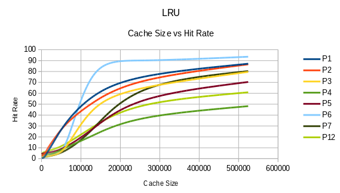

# caching

A project that simulates different cache replacement policies such as
least recently used (lru) and adaptive replacement cache (acr). The
simulations are done on real application caching traces.

## Building

To build the project, do:

    make

## Tests

To run all the tests, do:

    make test

If the tests are taking too long to run, and you want to run them in
parallel, do:

    make test -j

The tests completed in about 2 minutes on `general.asu.edu`.

## Input

Sample input is in the `trace` directory. The format is:

- starting block: the starting block of the cache request.
- number of blocks: the number of blocks starting from the starting block.
  This simulates the concept of locality.
- ignore
- request number: The request number; think line counter.

Theses fields are reflected in the `trace_line` struct in `main.c`.

```c
typedef struct {
  int starting_block;
  int number_of_blocks;
  int ignore;
  int request_number;
} trace_line;
```

## Output

A sample output file is included `output.txt`. The format is:

- file: the trace file used to generate the line of output.
- capacity: the capacity of the cache in pages; ex: `32768 = (16*1024*1024)/512`.
- algo: the replacement algorithm (lru or acr).
- requests: the total number of requests to the cache.
- hits: the total number of cache hits.
- ratio: the ratio `hits/requests`.

## Details

Below are some implementation details for the cache replacement algorithms
implemented in this project.

### LRU

To calculate the lru for the input trace files, I needed to maintain an
ordering of the recently accessed pages. To do this I used a doubly linked
list (implemented in `list.h` and `list.c`). However, a linked list has
linear search time. To improves search, I used a map (implemented in
`map.h` and `map.c`) to have practically constant time search of the
linked list.

The following image summarizes the results from the lru simulation:



For all of the provided trace files, as the size of the cache increases, The hit
rate also increases. However, it does so at a decreasing rate.

### ACR

TODO...

